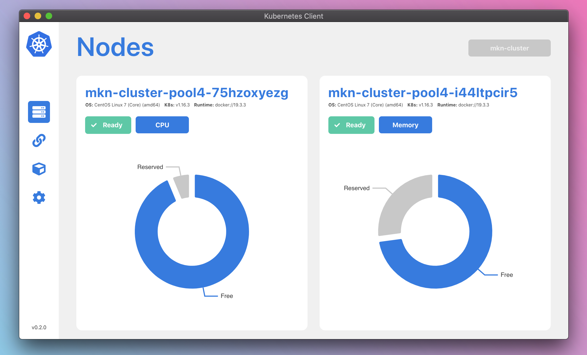
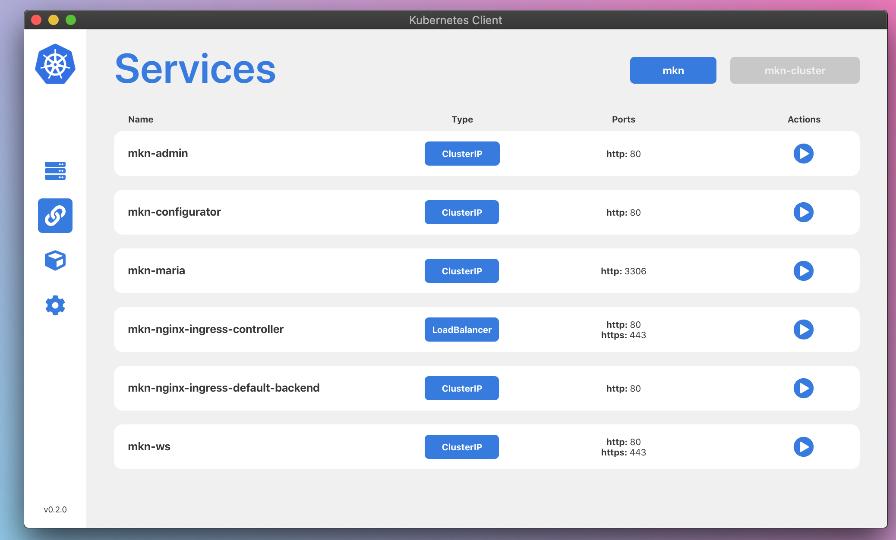
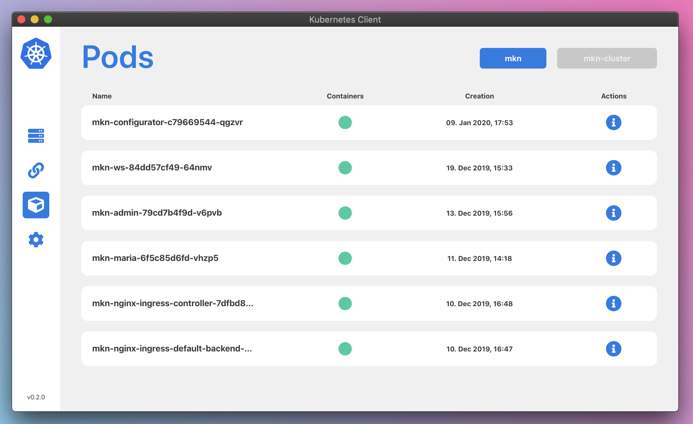
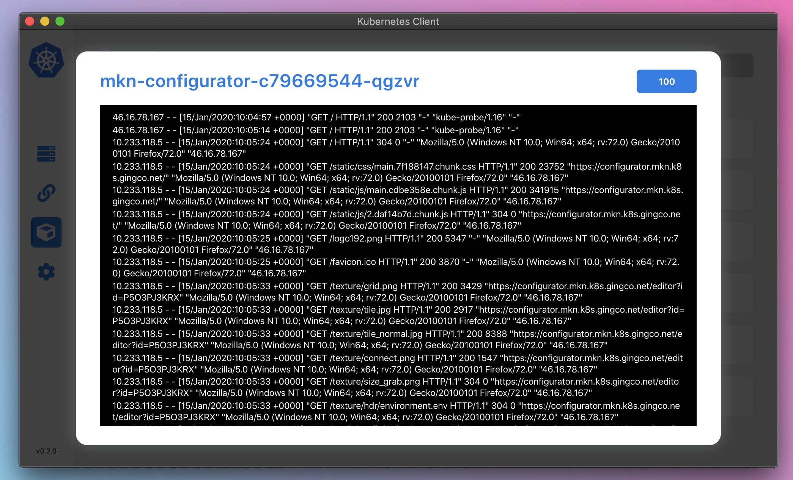

# Kubernetes-Client ❤️

This project was bootstrapped with [Create React App](https://github.com/facebook/create-react-app).

## Screenshots

1. Displaying current Cluster Nodes.



2. Displaying Services for current Namespace with option to start Port Forwarding to Service



3. Displaying Pods for current Namespace with option to show container logs



4. Logging-Extract from all Pod Containers



## Development

Yarn is strongly recommended.

#### Development

```
yarn start
```

#### Building

```
yarn build
```

## Packages & Modules

- [Command Line](https://www.npmjs.com/package/node-cmd)
- [K8s Client](https://github.com/godaddy/kubernetes-client)

## Design Inspirations

- [Weather App](https://dribbble.com/shots/6066535-Weather-Analysis-Process-Dashboard)
